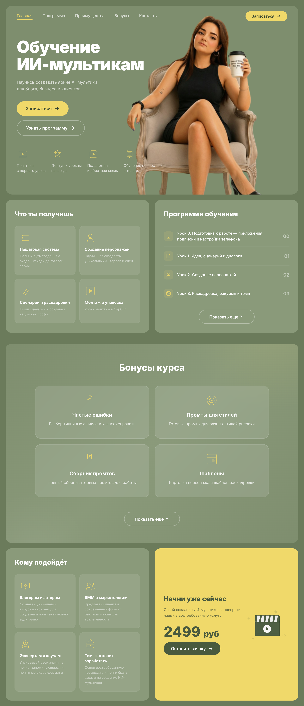

# 🎬 Обучение ИИ-мультикам — сайт курса и Telegram-бот

Лендинг курса «Обучение ИИ-мультикам» + Telegram-бот, который принимает оплату
через ЮKassa и автоматически выдаёт доступ к курсу после подтверждения платежа.

🌐 **Сайт:** https://antonovaai.ru/
🤖 **Бот:** [@antonovaai_multiki_bot](https://t.me/antonovaai_multiki_bot)

## ✨ Что умеет проект

- 🌐 **Сайт-лендинг** — рассказывает о курсе и ведёт пользователя в Telegram-бот
- 🤖 **Telegram-бот** — показывает программу курса, принимает оплату, выдаёт доступ
- 💳 **Оплата через ЮKassa** — платёж создаётся через API, доступ выдаётся только после подтверждения
- 🛡️ **Защита от «холявщиков»** — кнопка «Я оплатил» проверяет платёж в ЮKassa, без реальной оплаты доступ не выдаётся

## 🖼️ Превью сайта



## 📁 Структура проекта

```text
website_learning_ai_cartoons/
├── index.html              # Главная страница сайта
├── .gitignore              # Что не загружать на GitHub
├── README.md               # Документация проекта
│
├── css/                    # Стили сайта (модульная структура)
│   ├── variables.css       # CSS-переменные (цвета, шрифты)
│   ├── reset.css           # Сброс браузерных стилей
│   ├── style.css           # Базовые стили
│   ├── hero.css            # Главный экран (hero)
│   ├── buttons.css         # Кнопки
│   ├── burger.css          # Бургер-меню
│   ├── modal.css           # Модальные окна
│   ├── bonuses.css         # Секция бонусов
│   ├── info-row.css        # Информационные блоки
│   ├── bottom-row.css      # Нижняя секция / футер
│   └── responsive.css      # Адаптивность
│
├── js/                     # Скрипты сайта
│   ├── main.js             # Главный скрипт
│   ├── burger-menu.js      # Бургер-меню
│   ├── smooth-scroll.js    # Плавная прокрутка
│   ├── active-nav.js       # Подсветка активного пункта навигации
│   ├── scroll-anim.js      # Анимации при прокрутке
│   ├── bonuses-slider.js   # Слайдер бонусов
│   ├── module-slider.js    # Слайдер программы курса
│   └── form.js             # Обработка форм
│
├── img/                    # Изображения
│   ├── favicon.png         # Иконка сайта
│   └── ava.png             # Аватар
│
├── docs/                   # Материалы для документации
│   └── site-preview.png    # Скриншот сайта для README
│
└── telegram_bot/           # Telegram-бот (Python + aiogram)
    ├── bot.py              # Точка входа
    ├── config.py           # Загрузка настроек из .env
    ├── handlers.py         # Обработчики команд и кнопок
    ├── keyboards.py        # Инлайн-клавиатуры
    ├── messages.py         # Все тексты бота
    ├── yookassa_api.py     # Интеграция с ЮKassa
    ├── requirements.txt    # Зависимости
    ├── .env.example        # Пример настроек (без секретов)
    └── .env                # Секреты (НЕ коммитится, живёт только на сервере)
```

## 🌐 Сайт

Статический лендинг (HTML + модульный CSS + vanilla JS). Хостится на **Netlify**.

Реализовано: бургер-меню, слайдеры программы и бонусов, плавная прокрутка,
анимации при скролле, адаптивность под мобильные устройства.

### Деплой сайта

1. Внеси изменения в `index.html`, `css/` или `js/`
2. Перетащи папку с сайтом в зону **Production deploys** на netlify.com
3. Через 10–20 секунд сайт обновится

## 🤖 Telegram-бот

### Локальный запуск (для разработки)

```bash
cd telegram_bot
python3 -m venv venv
source venv/bin/activate
pip install -r requirements.txt
cp .env.example .env   # и заполни своими данными
python bot.py
```

> ⚠️ Не запускай бота локально с боевым токеном, пока работает сервер —
> два процесса с одним токеном конфликтуют.

### Запуск на сервере (VPS, Ubuntu)

Бот работает как systemd-служба `telegram_bot` с автозапуском и
автоматическим перезапуском при сбоях.

## ⚙️ Переменные окружения (.env)

Файл `.env` лежит в `telegram_bot/` и **не попадает в GitHub** (добавлен в `.gitignore`).
Пример заполнения — в `.env.example`.

| Переменная            | Описание                    | Пример              |
| --------------------- | --------------------------- | ------------------- |
| `BOT_TOKEN`           | Токен бота от @BotFather    | `123456:ABC-DEF...` |
| `PRICE`               | Цена курса                  | `2499`              |
| `CURRENCY`            | Валюта                      | `руб`               |
| `COURSE_LINK`         | Ссылка на курс после оплаты | `https://t.me/+...` |
| `SUPPORT_USERNAME`    | Username поддержки (без @)  | `username`          |
| `ADMIN_ID`            | Telegram ID администратора  | `123456789`         |
| `YOOKASSA_SHOP_ID`    | ID магазина ЮKassa          | `1426552`           |
| `YOOKASSA_SECRET_KEY` | Секретный ключ ЮKassa       | `live_...`          |

## 🔄 Деплой обновлений бота

1. На компьютере:
   ```bash
   git add .
   git commit -m "описание изменений"
   git push
   ```
2. На сервере (SSH):
   ```bash
   cd /root/website_learning_ai_cartoons/telegram_bot
   git pull
   systemctl restart telegram_bot
   ```

## 🛠 Полезные команды на сервере

```bash
systemctl status telegram_bot                 # состояние бота
systemctl restart telegram_bot                # перезапуск
systemctl stop telegram_bot                   # остановка
journalctl -u telegram_bot -n 50 --no-pager   # последние логи
```

## 🛡️ Безопасность

- Секреты (токен бота, ключи ЮKassa) хранятся только в `.env` на сервере
- Репозиторий приватный
- Кнопка «Я оплатил» не выдаёт доступ без подтверждения платежа в ЮKassa

## 🧪 Тестирование оплаты

Для теста временно ставится минимальная цена в `.env` (`PRICE=10`),
проходится реальная оплата, затем цена возвращается. Возврат платежа —
в кабинете ЮKassa: «Операции» → платёж → «Вернуть деньги».

---

Разработчик: **Артур Антонов** · Telegram: [@Arthur4ikAntonov](https://t.me/Arthur4ikAntonov)
